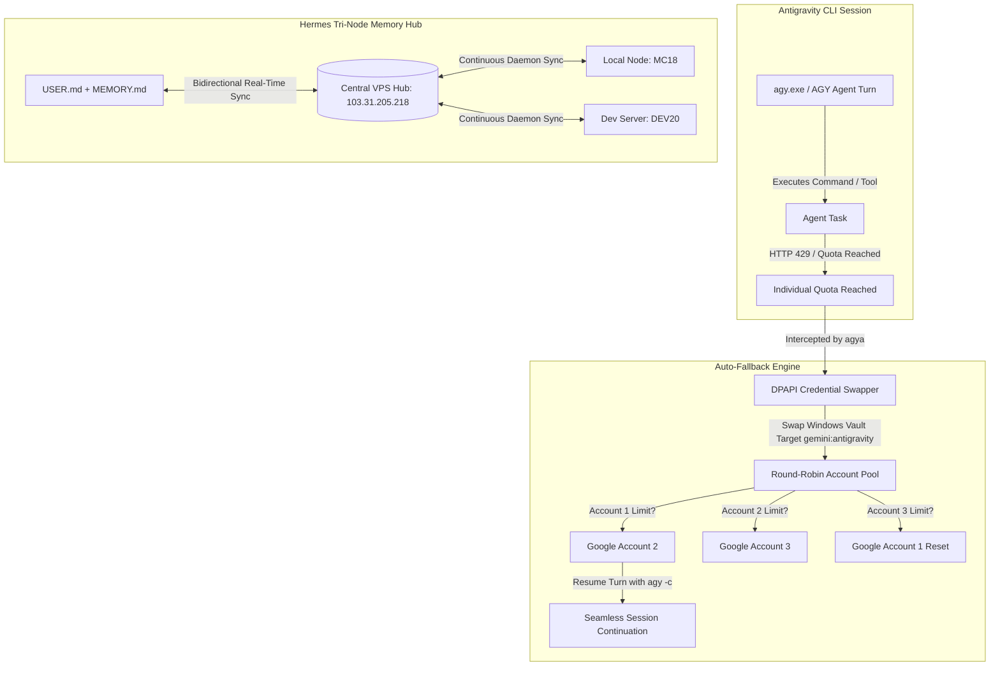

# ⚡ Antigravity Resilience Toolkit (`agy-resilience-toolkit`)

[](LICENSE)
[]()
[]()
[]()
[]()

> **Enterprise-Grade Resilience & High-Availability Suite for Google Antigravity CLI (`agy`)**  
> Seamless Multi-Account Google Quota Auto-Fallback, Tri-Node Hermes Persistent Memory Mirroring, and Zero-Token-Loss Session Resumption.

---

## 📌 Background & Architecture Problem

When conducting autonomous agentic development using **Google Antigravity CLI (`agy`)**, developers frequently hit the dreaded quota limit:

```text
[x] Individual quota reached. Please upgrade your subscription to increase your limits. Resets in 2h53m55s.
Error ID: cc03452d-004d-477b-8a54-0ea748aa8a3f-783
```

### Why Does This Happen?
1. **Single-Account Keyring Limitation:** Antigravity CLI binds authentication strictly to the OS keyring (`Windows Credential Manager` under `LegacyGeneric:target=gemini:antigravity` or Linux Secret Service).
2. **Lack of Native Cascading:** The core binary (`agy.exe`) has no built-in mechanism to switch Google accounts or fall back when HTTP 429 / quota exhaustion occurs.
3. **Session Interruption:** Long-running coding tasks fail midway, losing context and momentum unless manually recovered.

---

## 🚀 The Solution: Antigravity Resilience Toolkit

This toolkit provides an end-to-end resilience layer composed of three synchronized pillars:



---

## 🌟 Key Capabilities

### 1. Web UI Alternative with Image Vision & Screenshot Paste (`webui`)
- **Drag-and-Drop & Clipboard Paste (`Ctrl + V`):** Easily attach UI mockups, screenshots (`Win + Shift + S`), or bug images directly to your AGY prompts.
- **Modern Glassmorphism UI:** Responsive, executive dark interface featuring real-time SSE streaming, Markdown parsing, and syntax-highlighted code blocks with 1-click copy.
- **Built-in Account Switcher & Model Selector:** Change Google accounts or AI models directly from the browser navbar.
- **1-Click Launchers:** Launch via `agya web` or the desktop shortcut icon.

### 2. Multi-Account Google Auto-Fallback (`account_manager`)
- **Native Windows DPAPI Keyring Swapping:** Directly interacts with `Advapi32.dll` via `ctypes` to read and swap the `gemini:antigravity` credential in `< 10ms` without restarting the OS or re-authenticating.
- **Unlimited Account Rotation:** Register 2, 5, 10+ Google accounts (`agy-account add <name>`).
- **Round-Robin Cascading:** When Account 1 is exhausted, it automatically promotes Account 2 and continues the conversation (`agy -c`).
- **Zero Token Loss:** Working directories, file changes, and conversation IDs are fully preserved.

### 3. Hermes Tri-Node Persistent Memory Sync (`memory_sync`)
- **Durable Memory Architecture:** Modeled after Hermes Agent (Nous Research), separating User Persona (`USER.md`), Project Conventions (`MEMORY.md`), and System Policy (`AGENTS.md`).
- **Tri-Node Mirroring:** Real-time synchronization between Local PC (**MC18**), Dev Server (**DEV20**), and Cloud Production Server (**VPS**).
- **Autonomous Learning Loop:** The agent autonomously appends newly discovered solutions, credentials, or architectural patterns to `MEMORY.md`.

### 3. Model Cascading & Quota Probing (`fallback_runners`)
- **Model Cascade Sequence:** `Gemini 3.8 Flash` ➔ `Claude Sonnet 4.6` ➔ `Gemini 3.7 Flash` ➔ `Gemini 3.1 Pro` ➔ `GPT-OSS 120B`.
- **Pre-Flight Health Checks (`agya check`):** Sends 1-token health probes across all models to display real-time quota status.
- **Linux / VPS Shell Edition (`agy-fallback.sh`):** Full Bash compatibility for Linux headless servers and VPS environments.

---

## 📂 Repository Structure

```text
agy-resilience-toolkit/
├── webui/                     # Antigravity Web UI (Vision & Multi-Account Hub)
│   ├── server.py              # Flask SSE Streaming Server
│   ├── templates/index.html   # Glassmorphism Frontend (Drag & Drop, Ctrl+V)
│   └── uploads/               # Local cache for attached images/screenshots
├── account_manager/
│   ├── agy_account.py         # Core Python DPAPI Credential Swapper
│   ├── agy-account.cmd        # Windows CMD/Batch wrapper
│   ├── agya.cmd               # Fast alias command for daily usage
│   └── agya-web.cmd           # Web UI launcher
├── fallback_runners/
│   ├── agy-fallback.ps1       # PowerShell Model Fallback runner
│   ├── agy-fallback.cmd       # Windows wrapper for model fallback
│   └── agy-fallback.sh        # Linux Bash edition for VPS
├── memory_sync/
│   ├── hermes-memory-sync.js  # Node.js sync engine
│   ├── hermes-sync-daemon.ps1 # Background sync daemon
│   ├── sync-once.ps1          # One-shot manual push/pull sync
│   ├── loop-sync.ps1          # Scheduled heartbeat loop
│   ├── run-sync-daemon.ps1    # Silent daemon launcher
│   ├── start-sync.vbs         # VBScript background launcher
│   └── templates/             # Starter templates for USER, MEMORY & AGENTS
├── install.ps1                # Automated 1-click installer (PowerShell)
├── install.bat                # Automated 1-click installer (CMD)
├── .gitignore                 # Security-hardened gitignore
├── LICENSE                    # MIT License
└── README.md                  # Complete Documentation
```

---

## 🛠️ Installation & Setup

### 1. Windows (One-Click Installer)
Clone the repository and run the installer:
```powershell
git clone https://github.com/PrimeFox59/agy-resilience-toolkit.git
cd agy-resilience-toolkit
.\install.ps1
```
*The installer automatically copies the global binaries to `%LOCALAPPDATA%\agy\bin`, which is already part of your system `PATH`.*

---

## 📖 Usage Guide

### A. Managing Multiple Google Accounts

#### 1. Check Saved Accounts Status
```cmd
agy-account list
```
*Sample Output:*
```text
=======================================================
      ANTIGRAVITY CLI (AGY) GOOGLE ACCOUNTS LIST       
=======================================================
 * akun1              : READY [SEDANG AKTIF]
 * akun2              : READY
 * akun3              : READY
-------------------------------------------------------
```

#### 2. Register Additional Google Accounts
To add your 2nd or 3rd Google account:
```cmd
agy-account add akun2
```
1. Browser opens the official Google login page.
2. Select your 2nd Google account and authorize.
3. The session token is saved securely into `account_profiles/akun2.dat`.

#### 3. Manual Account Switch
```cmd
agy-account switch akun2   # Instantly switch to Account 2
agy-account switch akun1   # Switch back to Account 1
```

#### 4. Instant Session Resume with Next Account
If an active session hits `Individual quota reached`:
```cmd
agya -c
```
*Swaps credentials to the next Google account with fresh quota and resumes the task without restarting.*

#### 5. Execute Commands with Auto-Fallback Protection
```cmd
agya -p "analyze repository and fix memory leaks"
```
*Runs with Account 1. If Account 1 hits quota, it catches the error, rotates to Account 2, and continues seamlessly.*

---

### B. Tri-Node Hermes Memory Sync

Keep your AGY agent's memory aligned across all development nodes:
```powershell
# Push local updates to central VPS hub
powershell -ExecutionPolicy Bypass -File memory_sync\sync-once.ps1 -Action push

# Pull latest memory updates from VPS hub
powershell -ExecutionPolicy Bypass -File memory_sync\sync-once.ps1 -Action pull
```

---

## 🔒 Security & Privacy Guarantee

- **Zero Credential Leaks:** All `.dat`, `.key`, and `metadata.json` files are explicitly excluded via `.gitignore`.
- **DPAPI Encryption:** Token blobs are extracted and restored using Microsoft Windows Data Protection API (`Advapi32.dll::CredReadW` and `CredWriteW`), preserving the OS credential isolation.
- **Local Storage Only:** No tokens or private session cookies are sent over external networks or third-party servers.

---

## 📄 License

This project is licensed under the [MIT License](LICENSE) © 2026 **PrimeFox59 (Galih Primananda)**.
